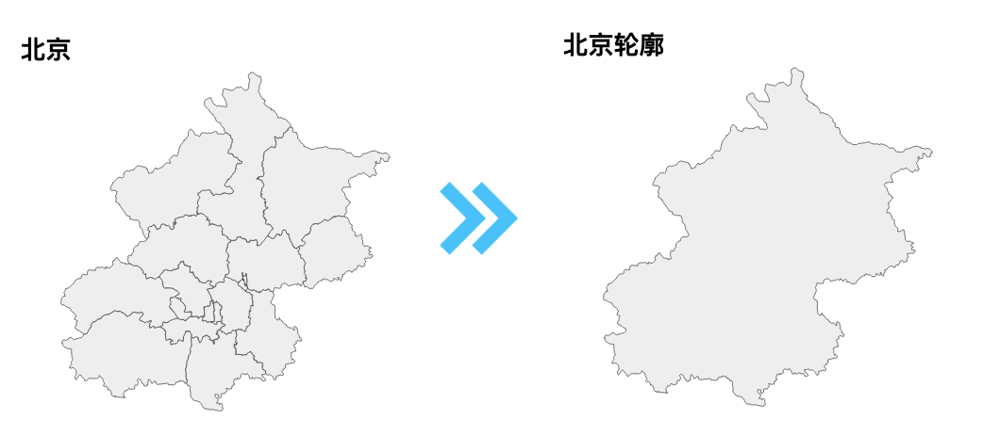

# 提取北京市的轮廓



现在，咱们就来看看怎么拿一个有[内部区界的北京市地图](https://github.com/echarts-maps/echarts-china-cities-js/blob/master/geojson/shape-with-internal-borders/beijing.geojson)来做一个北京市轮廓：

1. 我们需要装：node.js。我推荐大家装 [nvm](https://github.com/nvm-sh/nvm)，好处是可以随时转换 node.js 的版本。用得多了，你就知道它的好处了。
1. 装 mapshaper，echarts-mapmaker ```npm install -g mapshaper echarts-mapmaker```
1. 请从[这里](https://raw.githubusercontent.com/echarts-maps/echarts-china-cities-js/master/geojson/shape-with-internal-borders/beijing.geojson)下载北京的市区图。
1. 然后运行```mapshaper beijing.geojson  -dissolve2 -o beijing-shape-only.geojson```
1. 再打开 beijing-shape-only.geojson。