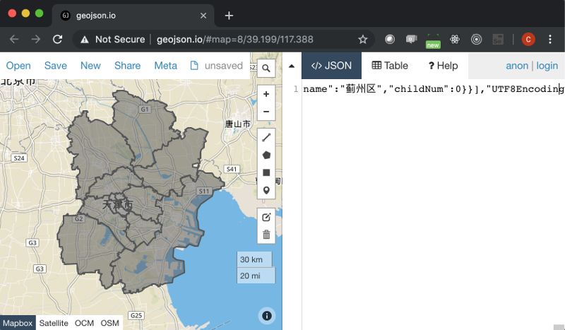
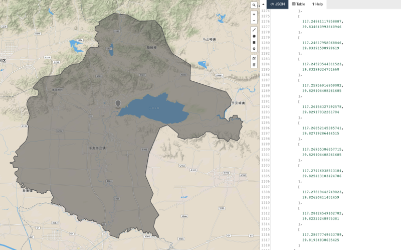
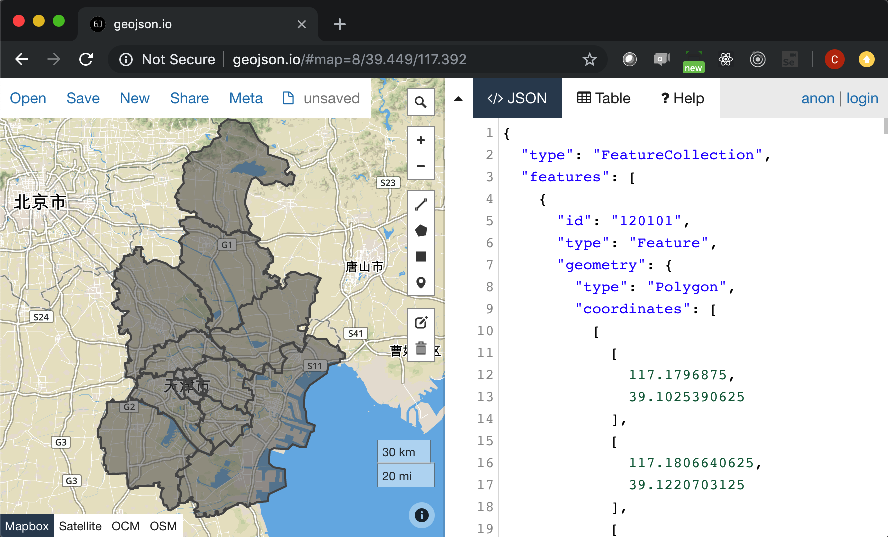

# 给天津市补上蓟洲区

[蓟洲区](https://baike.baidu.com/item/蓟州区)的前身是蓟县，2016年6月，成为天津市蓟州区。

## 简要操作顺序

1. 从这里下载[天津市区地图](https://raw.githubusercontent.com/echarts-maps/echarts-china-cities-js/2f9a518febbd59868f648ce08901d6993d6c0ba1/geojson/shape-with-internal-borders/tianjin.geojson)并存为 tianjin.geojson
1. 用浏览器打开 geojson.io，把下载的地图拽入浏览器。

    

1. 按照前面百度百科的蓟洲区地图，在浏览器里开始画 Polygon

    千万记住最后一个点，必须是第一个起始点。
    

1. 编辑完毕之后，新画的区留下了。辅助区消失了。请把右边的 geojson 给存成文件：jizhouqu.geojson

    

1. 这个时候就需要 echarts-mapmaker 了。

    ```
    $ npm install -g echarts-mapmaker
    $ merge tianjin.geojson jizhouqu.geojson
    $ ls merged_tianjin.geojson
    ```

1. `merged_tianjin.geojson` 就是最后制定好的新的天津市市区图

    
