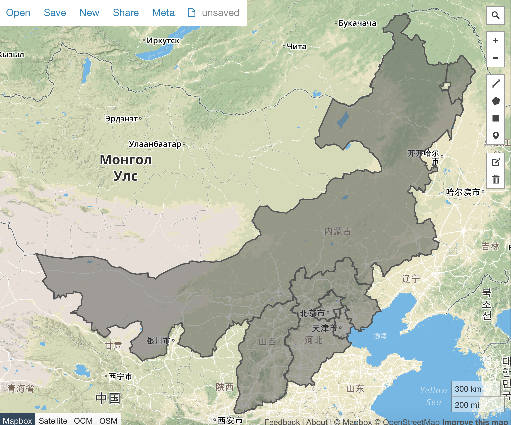

# 制作华北平原

## 开篇

想知道 [中国七大区](https://echarts-maps.github.io/echarts-china-misc-js/preview.html)
如何制作吗？这一篇讲解其中的技术细节，让大家轻松制作任意合集。


## 理论

用 [echarts-mapmaker](../tools/mapmaker) 和 echarts 现有的地图资源，制作华北平原是非常简单的事情。

如何呢？`echarts:map/json/china.json` 提供全国省份的题图。我们需要做的
就是把各个省份拆开，然后把华北平原的省份合起来。

## 简单操作

1. git clone https://github.com/apache/incubator-echarts。千万不要[下载](https://github.com/apache/incubator-echarts/issues/7522)
1. 把 incubator-echarts/map/json/china.json 拷贝到当前工作目录。
1. 拆分 `china.json`， 以得到所有独立的省份。

    ```
    $ split china.json
    $ ls
    china.json  		吉林.geojson		山东.geojson		江苏.geojson		海南.geojson		福建.geojson		陕西.geojson
    上海.geojson		四川.geojson		山西.geojson		江西.geojson		湖北.geojson		西藏.geojson		青海.geojson
    云南.geojson		天津.geojson		广东.geojson		河北.geojson		湖南.geojson		贵州.geojson		香港.geojson
    北京.geojson		宁夏.geojson		广西.geojson		河南.geojson		澳门.geojson		辽宁.geojson		内蒙古.geojson
    台湾.geojson		安徽.geojson		新疆.geojson		浙江.geojson		甘肃.geojson		重庆.geojson		黑龙江.geojson
    ```

    好了，现在都拆分开了。

2. 合并。还记得华北包括哪些省份吗？他们分别是：河北，内蒙古，山西，北京，天津。

    ```
    $ merge 河北.geojson 内蒙古.geojson 
    $ merge merged_河北.geojson 山西.geojson 
    $ merge merged_merged_河北.geojson 北京.geojson 
    $ merge merged_merged_merged_河北.geojson 天津.geojson 
    $ mv merged_merged_merged_merged_河北.geojson 华北.geojson
    ```

    怎么会有这么多 'merged_' ？`merge` 工具自动加一个前缀，运行多次，就有这么多了。有改进意见的话，可以告诉我。

3. 最后让我们来看看华北平原吧。

    请注意，我们现在得到的 华北.geojson 是用万国码编码过的，其他工具是打不开的。怎么办？

    ```
    decode 华北.geojson huabei.geojson
    ```

    然后打开 [geojson.io](http://geojson.io)，看到华北平原了吗？


    


## 如何去掉内部边界呢

1. 记住，我们先要解码。如果还没有这么做的话，请参看前面的的命令。
1. 用地图整形器抹掉内部边界

    ```
    mapshaper huabei.geojson -dissolve2 -o huabei-shape-only.geojson
    ```
1. 看看结果？

    

## 家庭作业

1. 参照[前面](add-ji-zhou-qu-to-tianjin.md)，把华北地图做成一个 js 的版本。
1. 做一个华中地图。
1. 再难一点，做一个中国七大区的地图。