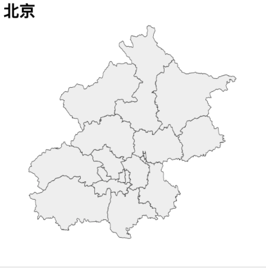
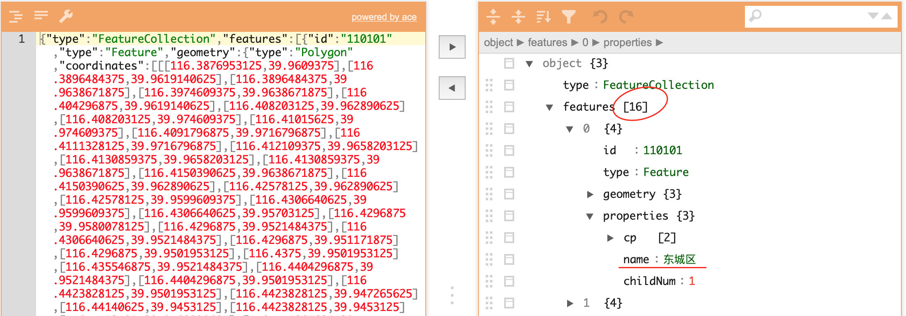
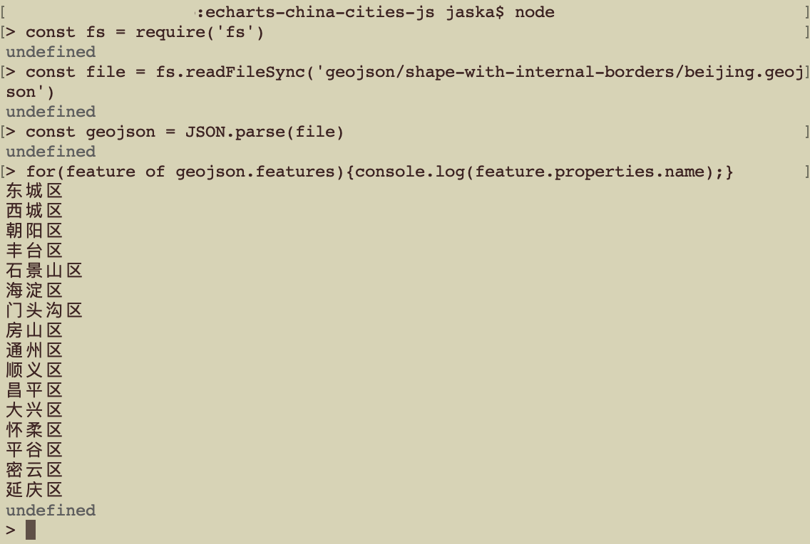

# 县级地图是从哪里来的

简单地说，县级地图大多是从城市地图拆分而来。拿北京做例子，可以把以下的地图



拆分成以下


## 理论

geojson，顾名思义，就是还有地理信息的 json (javascript object notation). 我们可以
用标准的 json 编辑器把 geojson 文件打开。以北京为例，把[北京]()地图文件拽到 json
编辑器（比如 [json editor online](https://jsoneditoronline.org)）里.



你会发现，她由 16 个形状组成的。比如第一个叫“东城区”。如果你装了 node.js 的话，我们
可以继续看看所有 16 个区的名字：



## 实际操作

既然知道是怎么回事了，拆分就比较简单明了了。用 echarts-mapmaker 的 split 命令：


```
$ split geojson/shape-with-internal-borders/beijing.json
$ ls
东城区.geojson		怀柔区.geojson		通州区.geojson
丰台区.geojson		房山区.geojson		顺义区.geojson
大兴区.geojson		昌平区.geojson		石景山区.geojson
密云区.geojson		朝阳区.geojson		门头沟区.geojson
平谷区.geojson		海淀区.geojson
延庆区.geojson		西城区.geojson
```

## 后记

[2882 个县，岛，区的地图](https://echarts-maps.github.io/echarts-china-counties-js/pages/index.html)就是这么得来的。