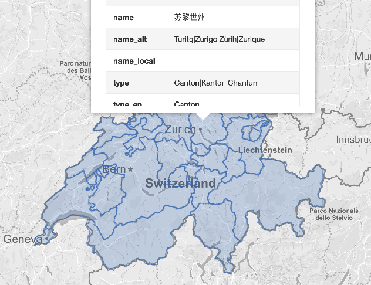

# 使用 natural earth 地图

## 什么是 natural earth 地图

## 如何用 natural earth 的数据做瑞士地图

开始之前，请装好 [GDAL](tools/gdal.md)

1. 首先把地[图包](https://www.naturalearthdata.com/http//www.naturalearthdata.com/download/10m/cultural/ne_10m_admin_1_states_provinces.zip)下载下来。在[这个下载页面](https://www.naturalearthdata.com/downloads/10m-cultural-vectors/)，选择 “Admin 1 - States, Provinces“ 。

    为什么呢？我需要内部的省份边界。你可以选择 "Admin 0 - Boundary lines"

1. 下载后，请解压缩。

1. 使用 `og2ogr` 命令，开始提取瑞士的图

    ```
    ogr2ogr -f GeoJSON -where "ADM0_A3 in ('CHE')" switzerland.geojson ne_10m_admin_1_states_provinces.shp
    ```

1. 让我们打开 geojson.io, 先看看效果吧。

    

## 在 echarts 里显示，还需做什么处理

1. natural earth 的数据提供了一些多语言的地名。因为目前， echarts-maps 还仅仅支持
中文，所以需要把名字的属性改一下。


    ```
    { "type": "Feature", "properties": { "featurecla": "Admin-1 scale rank", "scalerank": 9, "adm1_code": "CHE-168", "diss_me": 168, "iso_3166_2": "CH-TI", "wikipedia": null, "iso_a2":
"CH", "adm0_sr": 1, "name": "Ticino", "name_alt": "Tesino|Tessin", "name_local": null, "type": "Canton|Kanton|Chantun", "type_en": "Canton", "code_local": null, "code_hasc": "CH.TI"
, "note": null, "hasc_maybe": null, "region": null, "region_cod": null, "provnum_ne": 15, "gadm_level": 1, "check_me": 20, "datarank": 7, "abbrev": null, "postal": "TI", "area_sqkm"
: 0, "sameascity": -99, "labelrank": 9, "name_len": 6, "mapcolor9": 7, "mapcolor13": 3, "fips": "SZ20", "fips_alt": null, "woe_id": 2347102, "woe_label": "Canton of Ticino, CH, Swit
zerland", "woe_name": "Ticino", "latitude": 46.3604, "longitude": 8.79019, "sov_a3": "CHE", "adm0_a3": "CHE", "adm0_label": 2, "admin": "Switzerland", "geonunit": "Switzerland", "gu
_a3": "CHE", "gn_id": 2658370, "gn_name": "Cantone Ticino", "gns_id": -2554455, "gns_name": "Ticino, Cantone", "gn_level": 1, "gn_region": null, "gn_a1_code": "CH.TI", "region_sub": null, "sub_code": null, "gns_level": 1, "gns_lang": "swa", "gns_adm1": "SZ20", "gns_region": null, "min_label": 8.7, "max_label": 11.0, "min_zoom": 8.7, "wikidataid": "Q12724", "name_ar": "كانتون تيسينو", "name_bn": "তিকিনো", "name_de": "Kanton Tessin", "name_en": "Ticino", "name_es": "Tesino", "name_fr": "canton du Tessin", "name_el": "Τιτσίνο", "name_hi": "तिचीनो कैन्टन", "name_hu": "Ticino kanton", "name_id": "Kanton Ticino", "name_it": "canton Ticino", "name_ja": "ティチーノ州", "name_ko": "티치노 주", "name_nl": "Ticino", "name_pl":"Ticino", "name_pt": "Ticino", "name_ru": "Тичино", "name_sv": "Ticino", "name_tr": "Ticino", "name_vi": "Ticino", "name_zh": "提契諾州", "ne_id": 1159307671 }, "geometry": {...
    ```

1. echarts-mapmaker 有一个 `property` 的命令：

    ```
    property -r name_zh,name switzerland.geojson  
    ```

1. 再[查看](https://github.com/echarts-maps/echarts-countries-js/blob/master/geojson/shape-with-internal-borders/switzerland.geojson)的时候，它的名字就是中文的了。

    

## 相关的外部文章

[让我们做英国地图](https://bost.ocks.org/mike/map/)