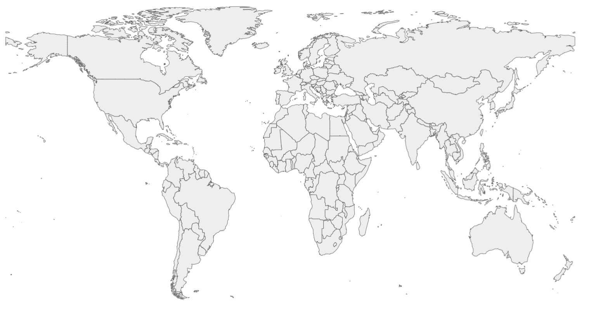
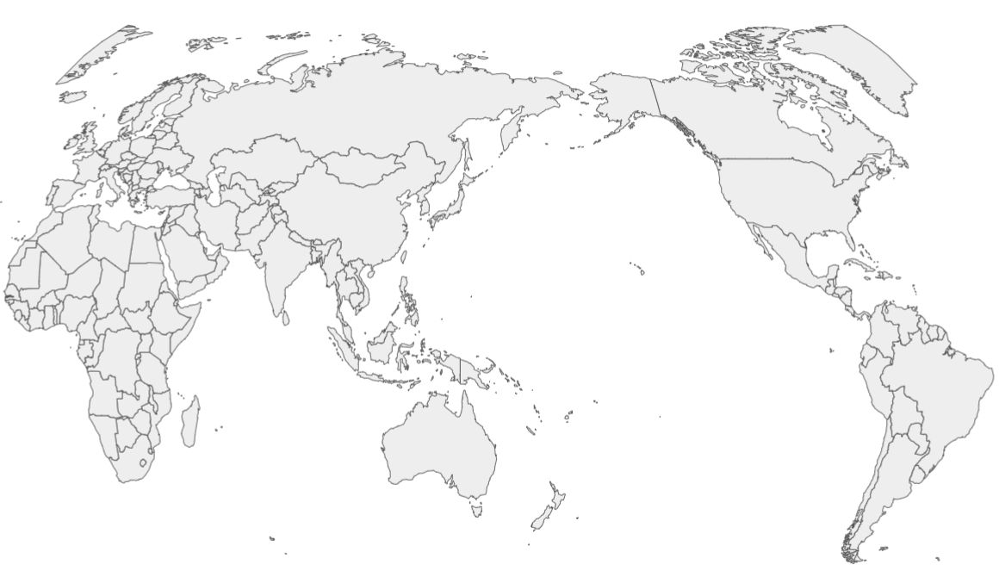

# 沙皇的工具

## 简介

说到数据可视化，就不能不谈到 Mike Bostock。他创作了最有名的 [d3](https://github.com/d3/d3) 。
他最新的创新就是 [d3-geo](https://github.com/d3/d3-geo-projection/blob/master/README.md#d3-geo-projection) 的命令行。在 echarts 的地图编辑工作里，很多技术的问题需要他的工具。

## 安装

1. 首先，需要 node.js。我在其他章节里提到过如何安装 node.js，这里就省略了。
1. 再需要就是用 `npm`

    ```npm install -g d3-geo-projection```

## 主要功能

### geoproject

[geoproject](https://github.com/d3/d3-geo-projection/blob/master/README.md#geoproject)
对 geojson 进行旋转，位移，和投影。

比如把下面以以格林尼治为中心的世界地图：



转换成以太平洋为中心的世界地图：


### geostitch

[geostitch](https://github.com/d3/d3-geo-projection/blob/master/README.md#geostitch)
可以把”破“的地图补起来。在里，俄国联邦被切成了两部分。在投影之前，我们需要把俄国联邦给先补起来。

## 参考

[Command-Line Cartography by Mike Bostock](https://medium.com/@mbostock/command-line-cartography-part-1-897aa8f8ca2c)