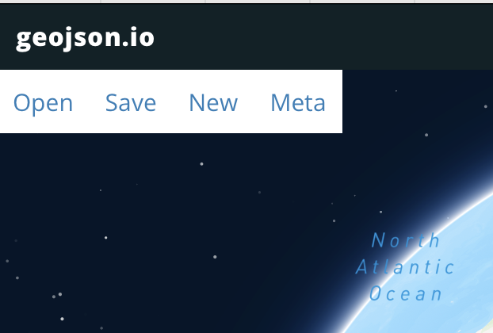
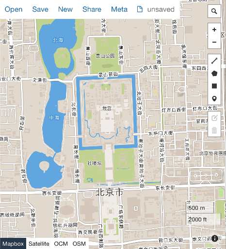
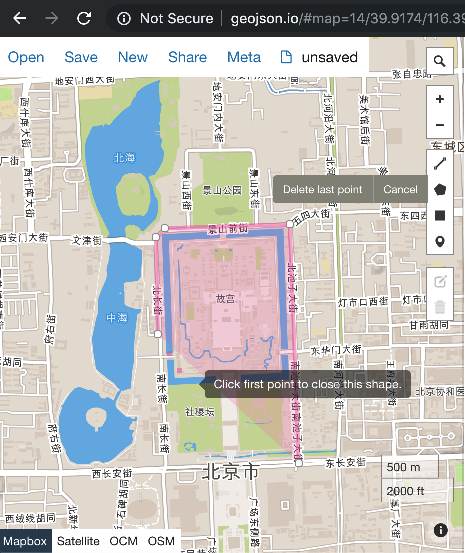
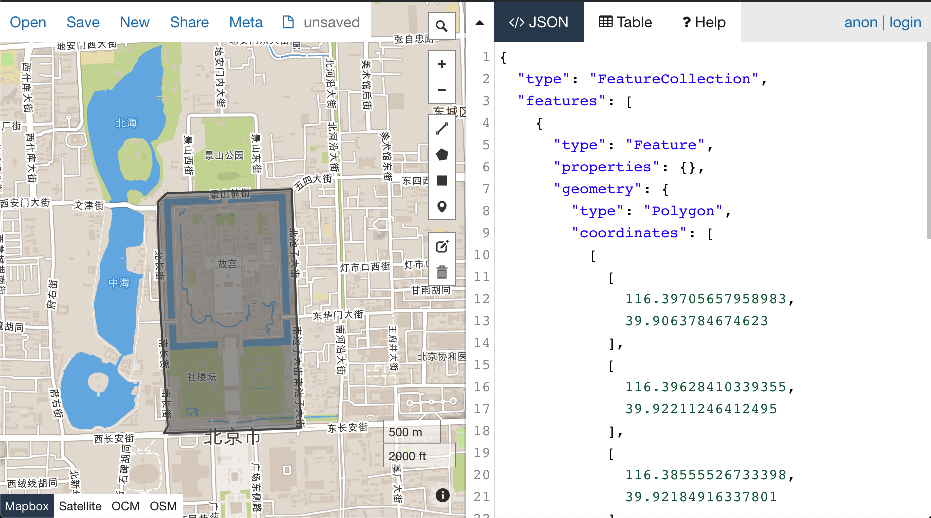

# 如何使用 geojson.io 的多边形编辑器

## 画第一个多边形: 北京紫禁城

1. 用浏览器打开 [geojson.io](http://geojson.io)

    

1. 用鼠标把北京找到，并放大地图找到紫禁城

    

1. 点击多边形图标，开始画

    

1. 最后，点击起点结束

    

1. 到左边，全选，拷贝，存到本地。
1. 然后呢，可以再打开一个新的 [geojson.io](http://geojson.io) 的窗口。把存下的文件，拽入右边的文字框。我们画的紫禁城又回来了。