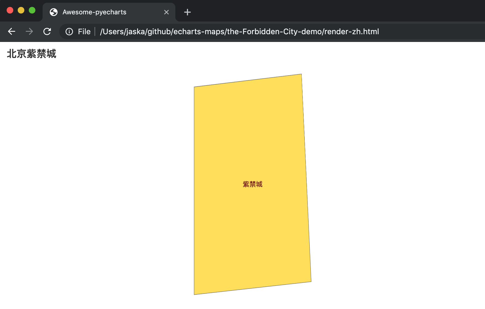

# 用 pyecharts 渲染

## 1. 准备工作

首先你需要 python 3.6 并已经装好了 pyecharts 1.0 以上的版本。

## 2. 渲染的代码

```python
from pyecharts import options as opts
from pyecharts.charts import Geo
from pyecharts.datasets import register_url

register_url("http://127.0.0.1:8000")

g = (
       Geo()
        .add_schema(maptype="紫禁城")
        .set_global_opts(
            title_opts=opts.TitleOpts(title="北京紫禁城"),
        )
)
g.render("render-zh.html")

```

## 3. 把代码存为 "The-Forbidden-City-zh.py" 并运行：

```
$ python The-Forbidden-City-zh.py
$ ls
render-zh.html ...
```

## 3. 在你的浏览器里打开 `render-zh.html`



