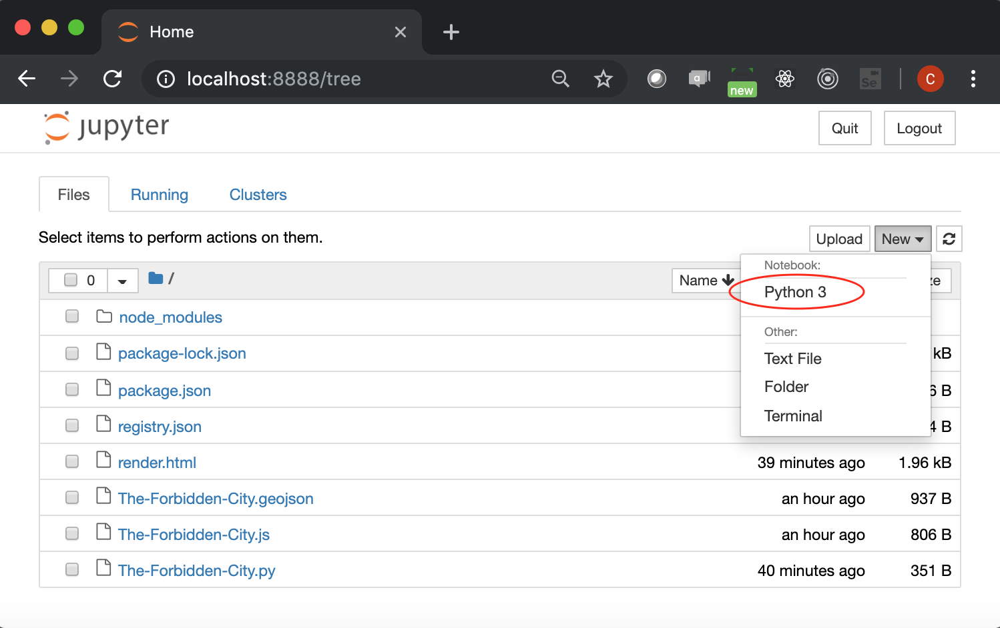
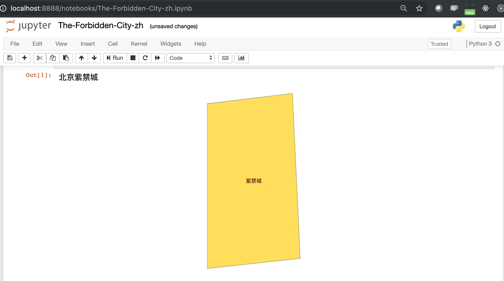

# 在 jupyter-notebook 里展示紫禁城

## 准备工作

1. 首先需要装上 jupyter-notebook。如果你已经有了，可以跳过

    ```pip install jupyter-notebook```


1. 如果你还没有装 pyecharts 的话， 你也需要运行下面的命令：

    ```pip install pyecharts>=1.2.0```


1. 打开 jupyter-notebook

    ```
    $ jupyter-notebook
    ```

1. 开启新的一一页

    

## 把下面的代码粘贴进去，然后运行：

```

from pyecharts import options as opts
from pyecharts.charts import Geo
from pyecharts.datasets import register_url

register_url("http://127.0.0.1:8000")

g = (
       Geo()
        .add_schema(maptype="紫禁城")
        .set_global_opts(
            title_opts=opts.TitleOpts(title="北京紫禁城"),
        )
)
g.render_notebook()

```

注意到了吗？其实上面的代码与前一节的代码没有太大差别。

## 这就是渲染的结果:

