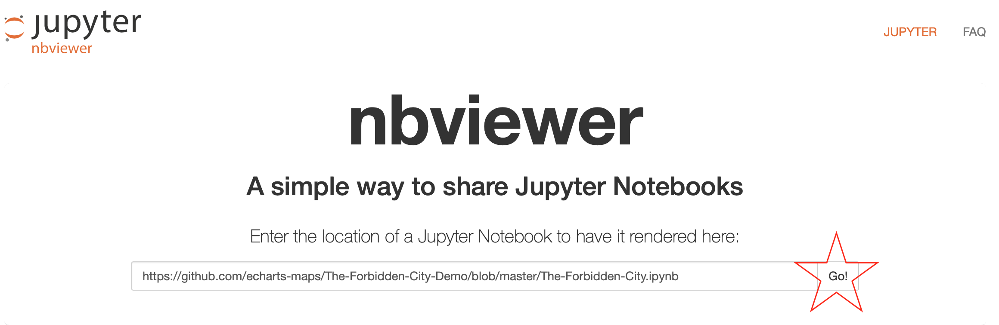
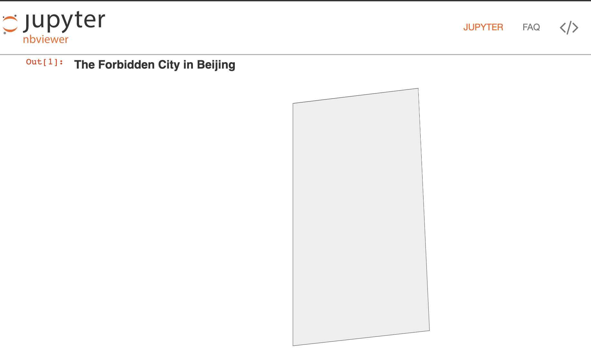

# 与他人分享

我们已经可以用 pyecharts, jupyter-noteook 把紫禁城画出来了。可以在与
别人分享的时候，我们不能用 127.0.0.1，而是需要一个公共服务器。

## 挂在 github 上

echart-maps 里的所有 js 文件其实都是关在 github 上的。

1. 先在本地创建一个 git 项目.

    ```$ git init```
   
    ```$ git add .```
   
    ```$ git commit -am "initial comment"```

1. 然后把这个项目放到 github 里
1. 在 github 的项目设定列开启 github pages：

    

1. 这个截屏告诉你是怎么做的：

    


1. 稍等一下，你的 github pages 就可以用了。


### 然后更新所有的代码：

```python
from pyecharts import options as opts
from pyecharts.charts import Geo
from pyecharts.datasets import register_url

register_url("https://echarts-maps.github.io/The-Forbidden-City-Demo") # <--

g = (
       Geo()
        .add_schema(maptype="The Forbidden City")
        .set_global_opts(
            title_opts=opts.TitleOpts(title="The Forbidden City in Beijing"),
        )
)
g.render()
```

### 现在可以分享了

1. 如果是 `render.html` 的话，你可以直接放在你的 github 项目里，就像这样: [https://echarts-maps.github.io/The-Forbidden-City-Demo/render.html](https://echarts-maps.github.io/The-Forbidden-City-Demo/render-zh.html)
2. 如果是 jupyter notebook 的画，你可以通过 [https://nbviewer.jupyter.org](https://nbviewer.jupyter.org) 分享。 看这个 [例子](https://nbviewer.jupyter.org/github/echarts-maps/The-Forbidden-City-Demo/blob/master/The-Forbidden-City-zh.ipynb).

    

1. 看这个渲染效果:

    


请注意，在用 jupyter-notebook viewer 的时候，时间有延迟。比如我这链接，我等了 24 小时 才得到应该有的效果。


## 其他的分享途径


1. 发布到 npm 然后用 [unpkg.com](http://unpkg.com) 
1. 发在阿里云上

